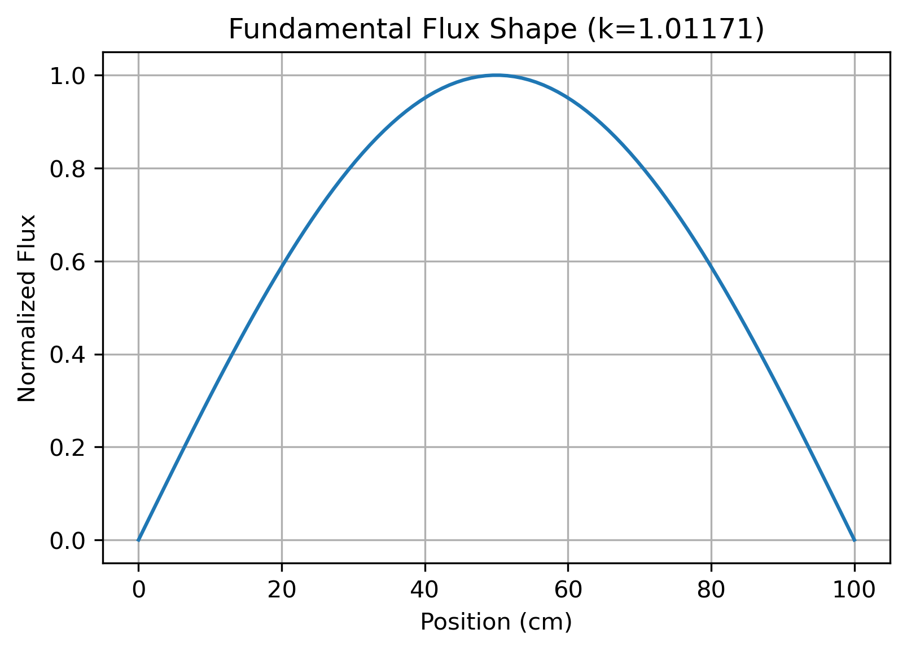
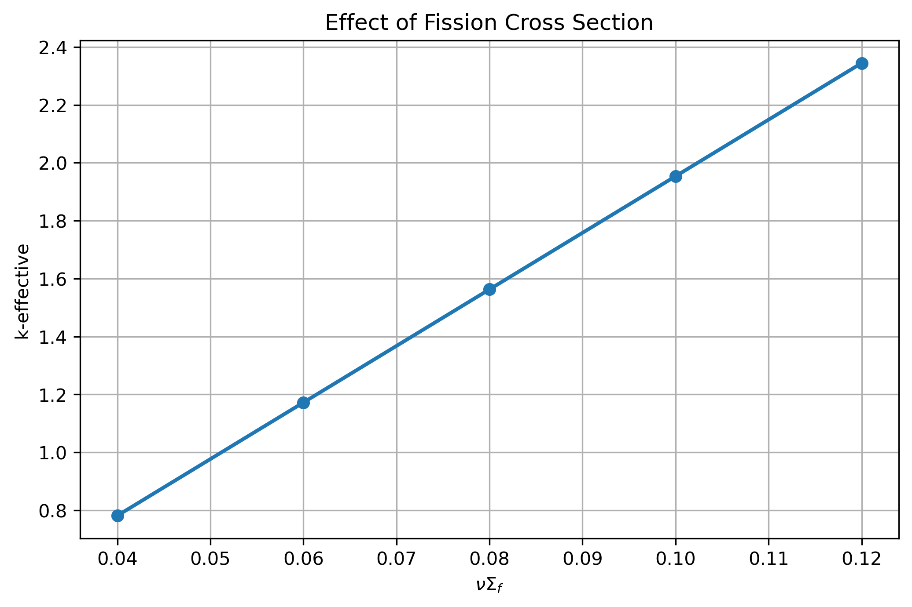
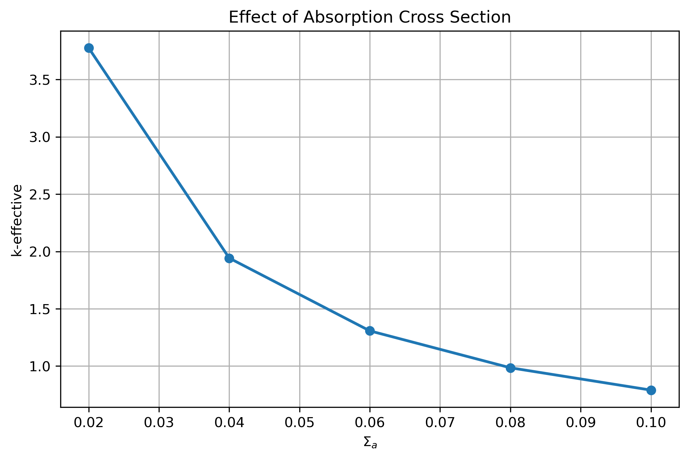
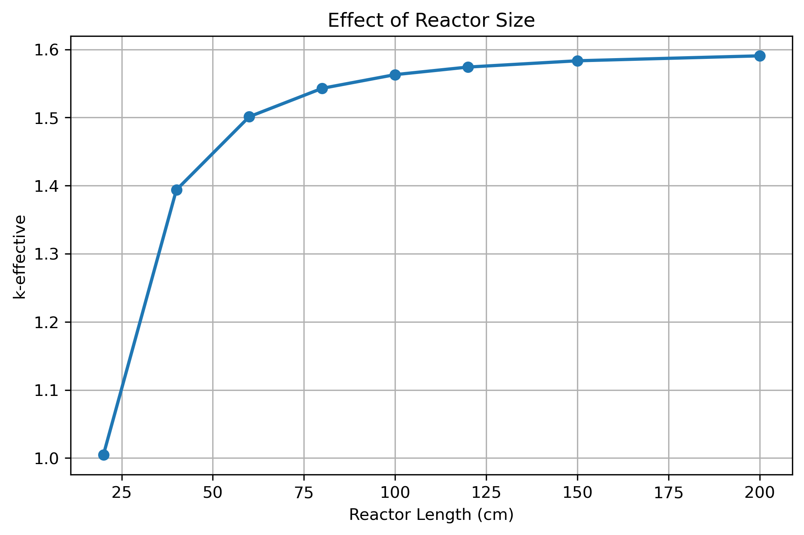
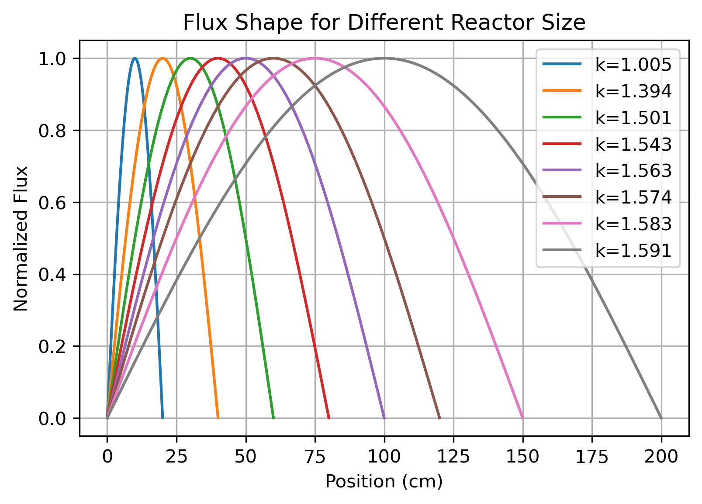
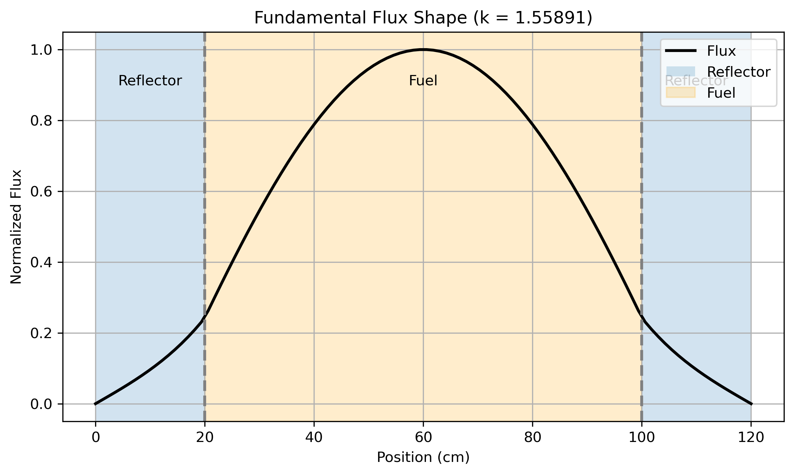

# 1D Neutron Diffusion Eigenvalue Solver

## Overview

This project implements a one-dimensional neutron diffusion solver using the Finite Difference Method (FDM) to calculate the fundamental neutron flux distribution and the effective multiplication factor (**k-effective**) in slab reactors.

Two reactor configurations are investigated:

- Homogeneous reactor
- Reflector–Fuel–Reflector heterogeneous reactor

The project introduces generalized eigenvalue problems, reactor criticality analysis, heterogeneous material modeling, and numerical solution of neutron diffusion equations.

---

# Governing Equation

The steady-state one-group neutron diffusion equation is

$$
-D\nabla^2\phi+\Sigma_a\phi=
\frac1k\nu\Sigma_f\phi
$$

where

- $\phi$ = neutron flux
- $D$ = diffusion coefficient
- $\Sigma_a$ = macroscopic absorption cross section
- $\nu\Sigma_f$ = neutron production cross section
- $k$ = effective multiplication factor

---

# Physical Interpretation

The equation represents the neutron balance inside a reactor.

Neutrons are

- produced by fission,
- absorbed by materials,
- transported by diffusion.

The multiplication factor determines reactor criticality:

- $k<1$ → Subcritical
- $k=1$ → Critical
- $k>1$ → Supercritical

---

# Numerical Method

The diffusion equation is discretized using second-order central finite differences.

For homogeneous media:

$$
-\frac{D}{\Delta x^2}\phi_{i-1}
+
\left(
\frac{2D}{\Delta x^2}
+\Sigma_a
\right)\phi_i
-\frac{D}{\Delax^2}\phi|{i+1}=
\frac1k\nu\Sigma_f\phi_i
$$

The resulting generalized eigenvalue problem is written as

$$
A\phi=\frac1kF\phi
$$

which is transformed into

$$
A^{-1}F\phi=k\phi
$$

and solved using NumPy's eigenvalue solver.

---

# Matrix Structure

## Loss Matrix

The matrix **A** contains neutron losses due to

- diffusion
- absorption

It is a sparse tridiagonal matrix.

## Production Matrix

The matrix **F** represents neutron production by fission.

For homogeneous fuel it is diagonal since neutron production is assumed to occur locally inside each spatial node.

---

# Homogeneous Reactor

A slab reactor with uniform material properties was first analyzed.

## Flux Distribution

The numerical solution exhibits the expected fundamental flux shape with maximum flux at the reactor center and zero flux at the boundaries.

---

# Parametric Studies

Several reactor parameters were investigated.

---

## Effect of Fission Cross Section

Increasing $\nu\Sigma_f$ increases neutron production and therefore increases the multiplication factor.

The spatial flux shape remains essentially unchanged.

---

## Effect of Absorption Cross Section

Higher absorption removes neutrons from the system, producing a lower multiplication factor.

---

## Effect of Reactor Length

Larger reactors experience lower neutron leakage and therefore exhibit higher values of k-effective.

---

## Flux Shape for Different Reactor Lengths

Unlike material properties, reactor geometry significantly affects the spatial distribution of neutron flux.

Increasing the reactor length broadens the fundamental mode and reduces leakage effects.

---

# Heterogeneous Reactor

The solver was extended to model a

**Reflector – Fuel – Reflector**

configuration.

Material properties vary spatially:

| Region | D | Σa | νΣf |
|---------|----|-----|------|
| Reflector | 2.0 | 0.01 | 0 |
| Fuel | 1.2 | 0.05 | 0.08 |

The diffusion coefficient at material interfaces is computed using the harmonic average

$$ D_{i+\frac12}=
\frac{2D_iD_{i+1}}
{D_i+D_{i+1}}
$$

which preserves neutron current continuity across interfaces.

---

## Flux Distribution

The presence of reflectors modifies the neutron flux distribution.

Neutrons diffuse into the reflector regions before gradually decaying toward the vacuum boundaries.

Compared with the homogeneous reactor, the reflector reduces neutron leakage and increases neutron utilization.

---

# Engineering Relevance

Neutron diffusion solvers constitute the foundation of many reactor physics codes.

The concepts implemented here are directly related to:

- Core neutronics
- Reactor criticality calculations
- Flux shape prediction
- Reflector design
- Diffusion theory
- Deterministic reactor analysis

---

# Skills Demonstrated

- Reactor Physics
- Neutron Diffusion Theory
- Generalized Eigenvalue Problems
- Finite Difference Method
- Sparse Matrix Assembly
- Numerical Linear Algebra
- Heterogeneous Material Modeling
- Solver Verification
- Scientific Computing with Python
- Data Visualization
- Git and GitHub Workflow

---

# Future Improvements

Potential extensions include:

- Two-group neutron diffusion
- 2D diffusion solver
- Power iteration algorithm
- Albedo boundary conditions
- Fuel depletion
- Time-dependent neutron diffusion
- Finite Volume Method
- OpenFOAM implementation
- Coupling with thermal calculations

---

# Tools

- Python
- NumPy
- Matplotlib

---